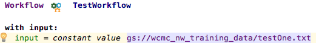

# CloudInteractive

## Overview
This software allows users to access, modify, and use their Google Cloud Storage files within MPS and NextflowWorkbench 1.6+

## Usage
CloudInteractive provides several tools for Google Cloud Storage files.

CloudFolder retrieves cloud files stored at the given gs:// URL. Additionally, there is CloudInteractivePath, which will autocomplete your gs:// URL, given you have configured the Google Cloud Project ID via a CloudConfig node.

All of these tools have been integrated into NextflowWorkbench as input channels through the cloud.interactive.workflow language. Finally, there is a cloud file matcher input channel that takes a gs:// URL, and a regex or wildcard expression to match and fetch cloud files for usage within a workflow.  

## Credits
Access to Google Cloud Storage files provided by [Google's API](https://cloud.google.com/storage/docs/json_api/). CloudInteractive was developed by [Radhika Mattoo](https://github.com/radhikamattoo) to support cloud file usage/access within MPS and NextflowWorkbench.

## Tutorial
See the following figures for examples of how to use the various tools within CloudInteractive via NextflowWorkbench:

Your first step should be configuring your Project ID via the CloudConfig node:

For CloudFolder, create the folder and fetch your files. Then simply use autocomplete within the workflow to use it as an input channel.

CloudInteractivePath is embedded in the NextflowWorkbench input channel editor as a Google Storage File Path Literal.

 The software will recognize if a string literal input is actually a gs:// URL, and will offer an intention to convert it for you.

Use the file matcher input channel if you'd like to match multiple files within a cloud storage directory to a specific expression.

 You can use the inspector to cycle through the matched file names 5 at a time.

